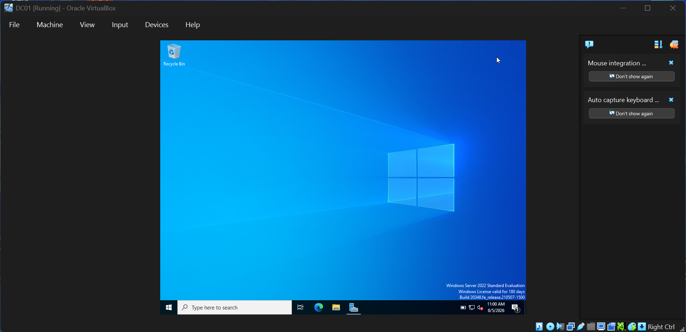
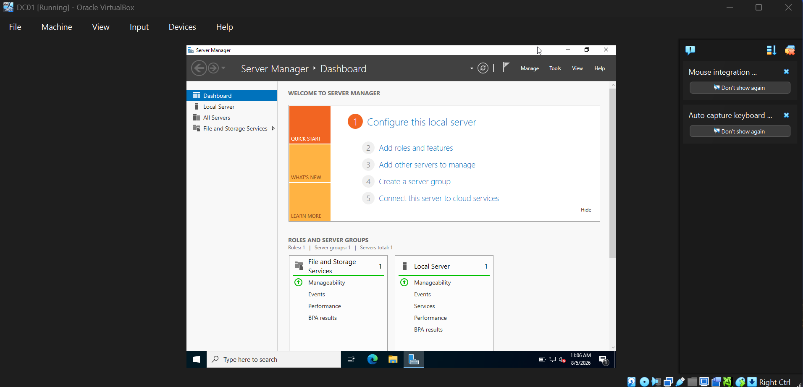

# Active Directory Home Lab

## Project Goal

To build a realistic Windows Server environment and gain hands-on experience with tasks commonly performed by IT Support and Help Desk professionals.

---

## Skills Demonstrated

- Windows Server Administration
- Active Directory
- User Management
- Security Groups
- Password Resets
- Account Administration
- Group Policy
- Troubleshooting

---

## Technologies Used

- VirtualBox
- Windows Server 2022
- Windows 10
- Active Directory Domain Services

---

## Progress Tracker

- [X] Install VirtualBox
- [X] Download Windows Server 2022
- [ ] Create Domain Controller
- [ ] Install Active Directory
- [ ] Create Organisational Units
- [ ] Create Users
- [ ] Create Security Groups
- [ ] Reset User Passwords
- [ ] Disable User Accounts
- [ ] Create Windows 10 Client
- [ ] Join Client To Domain
- [ ] Configure Group Policy

---

## Learning Notes  
## Step 1 - VirtualBox Installation
### What I Did
Successfully installed and launched Oracle VirtualBox.
### What I Learned
I learned that virtualization allows me to run multiple operating systems on one physical computer. Oracle VirtualBox will be used throughout this project to build a safe Active Directory lab without affecting my main Windows installation.

## Step 2 - Windows Server 2022 ISO
### What I Did
Downloaded the Windows Server 2022 Evaluation ISO from Microsoft.
### What I Learned
I learned that an ISO file contains the installation media required to install an operating system. I will use this Windows Server 2022 Evaluation ISO inside VirtualBox to build a realistic Active Directory lab environment.

## Step 3 - Windows Server Installation Complete
### What I Did
Successfully installed Windows Server 2022 and verified that the server booted to the Windows desktop.
### What I Learned
I learned how to deploy a Windows Server operating system inside a virtual machine. This server will later be promoted to a Domain Controller and will host Active Directory Domain Services for the lab.

## Step 4 - Server Manager Dashboard
### What I Did
Opened Server Manager after the first login and confirmed the installation completed successfully.
### What I Learned
I learned that Server Manager is the primary management console used to configure Windows Server. It allows administrators to install server roles and features, monitor the server, and manage services such as Active Directory.

---

## Screenshots / Evidence
### Step 1 - VirtualBox Successfully Installed
Oracle VirtualBox was successfully installed and is ready to host the Windows Server virtual machine.

### Step 2 - Windows Server 2022 ISO Downloaded
The Windows Server 2022 Evaluation ISO was downloaded successfully from Microsoft.

### Step 3 - Windows Server Installation Complete
Windows Server 2022 installation completed successfully, and the server booted to the desktop.

### Step 4 - Server Manager Dashboard
Server Manager opened automatically after the first login, confirming the installation was successful.

