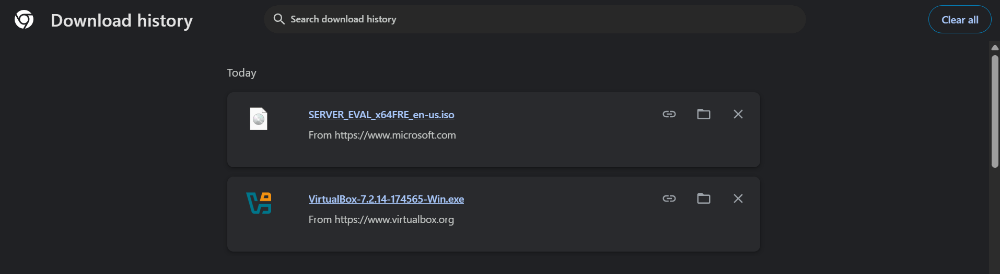

# Active Directory Home Lab

## Project Goal

To build a realistic Windows Server environment and gain hands-on experience with tasks commonly performed by IT Support and Help Desk professionals.

---

## Skills Demonstrated

- Windows Server Administration
- Active Directory
- User Management
- Security Groups
- Password Resets
- Account Administration
- Group Policy
- Troubleshooting

---

## Technologies Used

- VirtualBox
- Windows Server 2022
- Windows 10
- Active Directory Domain Services

---

## Progress Tracker

- [X] Install VirtualBox
- [X] Download Windows Server 2022
- [ ] Create Domain Controller
- [ ] Install Active Directory
- [ ] Create Organisational Units
- [ ] Create Users
- [ ] Create Security Groups
- [ ] Reset User Passwords
- [ ] Disable User Accounts
- [ ] Create Windows 10 Client
- [ ] Join Client To Domain
- [ ] Configure Group Policy

---

## Learning Notes  
### Step 1 - VirtualBox Installation

Successfully installed and launched Oracle VirtualBox.

I learned that virtualization allows me to create and run multiple virtual machines on one physical computer. I will use VirtualBox to create a simulated business IT environment for practising Windows Server, Active Directory, user administration, and troubleshooting.

### Step 2 - Windows Server 2022 ISO

Downloaded the Windows Server 2022 Evaluation ISO from Microsoft.

I learned that an ISO file contains the installation media needed to install an operating system. I will use this ISO inside VirtualBox to install Windows Server 2022 on a virtual machine rather than directly on my physical laptop.

This Windows Server virtual machine will later be configured as the domain controller for my Active Directory lab.

---

## Screenshots/ Evidence
### Step 1 - VirtualBox Successfully Installed

### Step 2 - Windows Server 2022 ISO Downloaded

